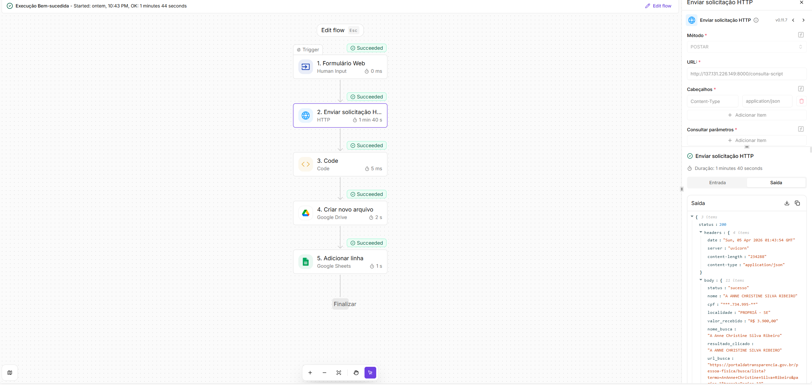

# Parte 2: desenho do workflow

Sugestão de plataforma: **Activepieces**. Motivos:

- plano gratuito suficiente para prototipar o fluxo;
- editor visual simples para demonstrar hiperautomação;
- conectores nativos para HTTP, Google Drive e Google Sheets;
- exportação do fluxo em JSON facilita apresentação técnica.

## Fluxo implementado

Entrada do usuário via formulário web do Activepieces:

- Formulário publicado: <https://cloud.activepieces.com/forms/RLSVQlGIDcQj4jJZVhSE5>

Sequência final do fluxo:



1. Trigger `Web Form` com um campo de entrada para `identificador` do beneficiário.
2. Passo HTTP `POST /consulta-script` enviando `identificador` e `timeout_ms`.
3. Passo `Code` para:
   - serializar o JSON completo com identação;
   - gerar `consulta_id` único com `crypto.randomUUID()`;
   - montar o nome do arquivo no padrão `[IDENTIFICADOR_UNICO]_[DATA_HORA].json`.
4. Passo Google Drive para criar o arquivo `.json`.
5. Passo Google Sheets `Adicionar linha` para registrar o resumo da consulta.

Exemplo de nome de arquivo gerado:

- `550e8400-e29b-41d4-a716-446655440000_2026-04-04_21-40-59.json`

Exemplo de corpo enviado no passo HTTP:

```json
{
  "identificador": "{{trigger.identificador}}",
}
```

Transformação no passo `Code`:

```javascript
export const code = async (inputs) => {
  const uniqueId = crypto.randomUUID();
  const date = new Date(inputs.http_date);
  const pad = (n) => String(n).padStart(2, '0');
  const timestamp =
    `${date.getUTCFullYear()}-${pad(date.getUTCMonth() + 1)}-${pad(date.getUTCDate())}_` +
    `${pad(date.getUTCHours())}-${pad(date.getUTCMinutes())}-${pad(date.getUTCSeconds())}`;

  return {
    consulta_id: uniqueId,
    json_text: JSON.stringify(inputs.body_json, null, 2),
    file_name: `${uniqueId}_${timestamp}.json`,
    nome: inputs.body_json.nome,
    cpf: inputs.body_json.cpf,
    status: inputs.body_json.status,
    data_http: inputs.http_date
  };
};
```

Link salvo no Sheets para o JSON do Drive:

```text
https://drive.google.com/file/d/{{step_drive.id}}/view
```

## Estrutura de registro no Sheets

Colunas:

- `consulta_id`
- `identificador_entrada`
- `nome`
- `cpf`
- `data_hora_consulta`
- `status`
- `link_json_drive`

## Tabela sincronizada ao fluxo de automação:

```text
https://docs.google.com/spreadsheets/d/1jP-pSZr5nLiRWRTEhshemGPGzEUhqnHtbY0_mEiHTdE/edit?usp=sharing
```


## Limitação operacional do formulário

- O formulário web publicado deve ser usado com **uma requisição por vez**.
- A razão é exclusivamente de infraestrutura da entrega: a API foi publicada em uma VM Oracle Free Tier com **1 GB de RAM**.
- Nessa configuração, não houve margem segura para manter múltiplas execuções simultâneas do navegador sem degradação severa.
- Por isso, o fluxo final foi documentado e operado de forma sequencial.

## Contexto de benchmark e capacidade esperada

- O código foi testado em benchmark controlado **em ambiente local** com **6 requisições simultâneas**, retornando em aproximadamente **13 segundos**.
- Para a entrega, a intenção era usar a opção gratuita mais robusta da Oracle com **24 GB de RAM**.
- Se essa máquina estivesse disponível, a expectativa prática era suportar algo entre **20 e 50 requisições simultâneas** gratuitamente, dependendo da carga do portal consultado.
- Essa opção não pôde ser utilizada porque, no momento da produção do teste técnico, **não havia disponibilidade** dessa classe de VM gratuita na Oracle Cloud.
